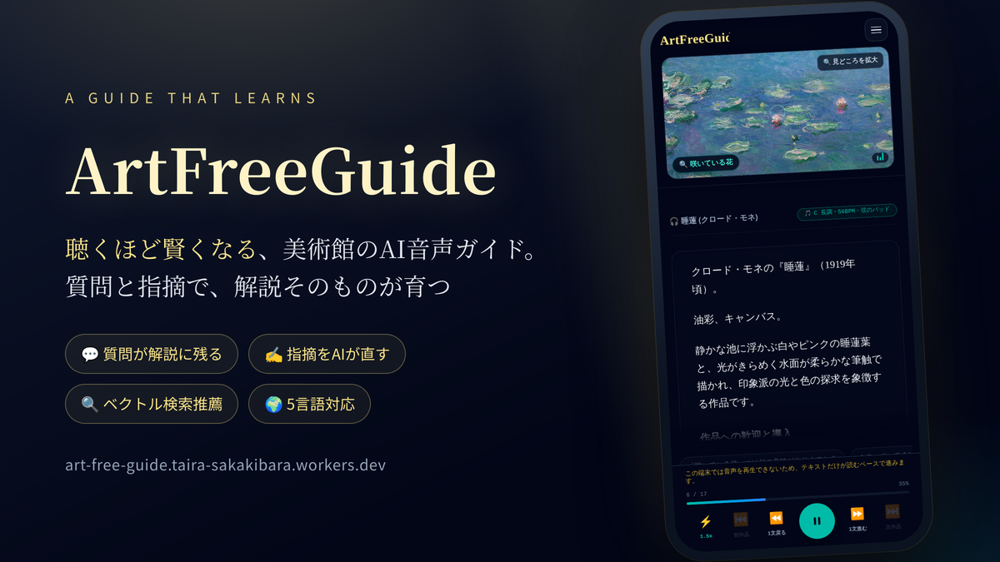
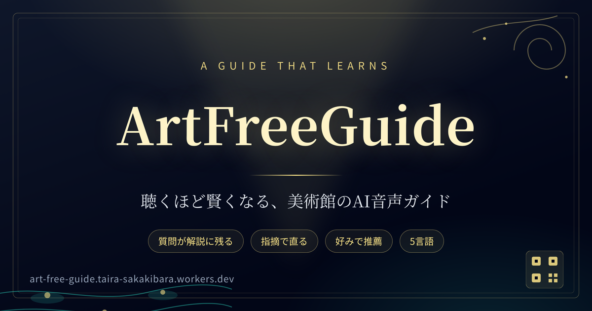
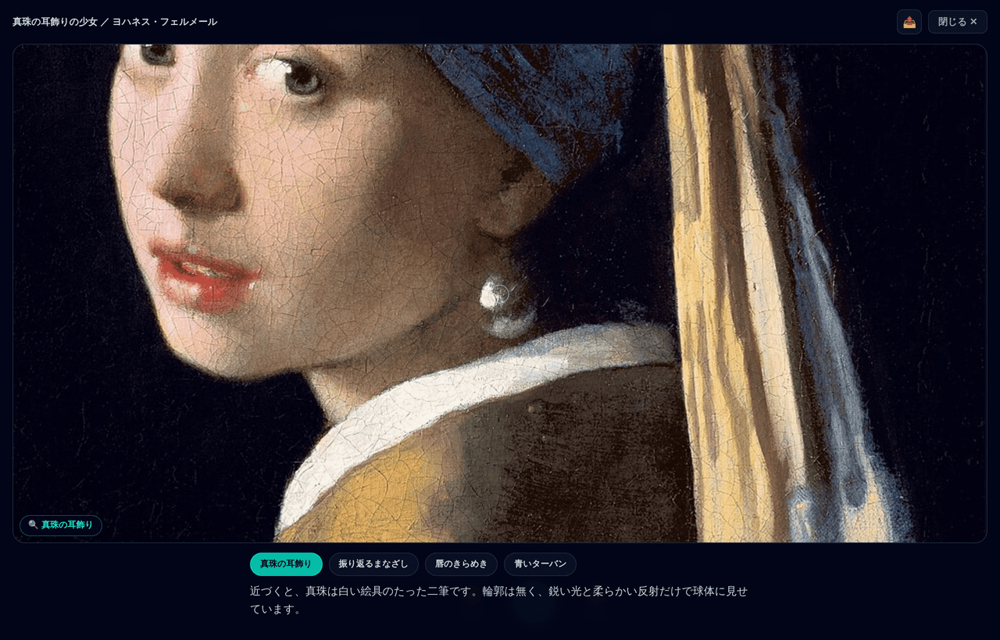
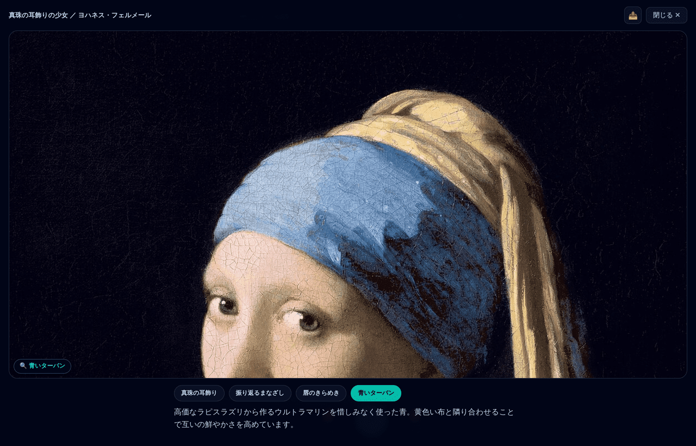
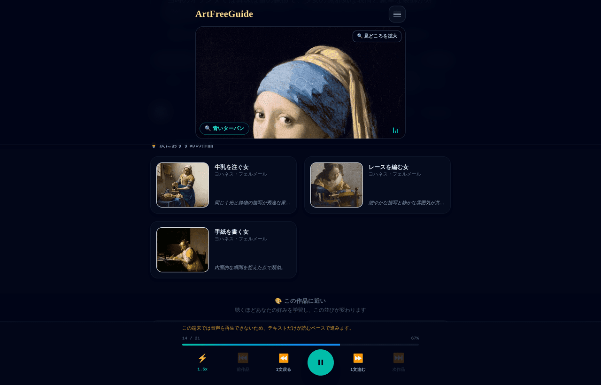
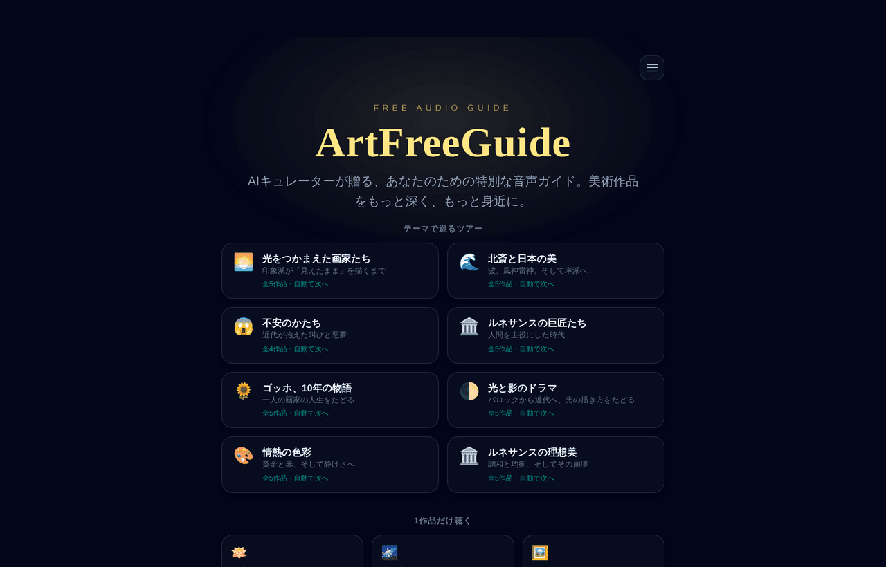
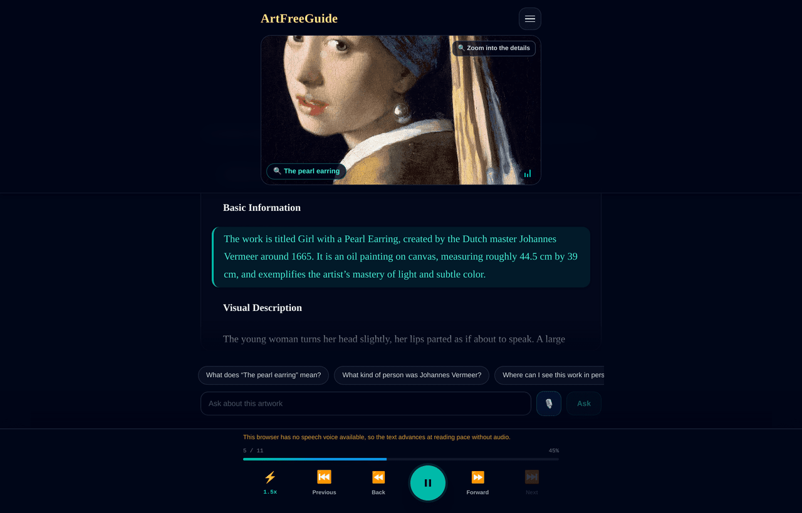
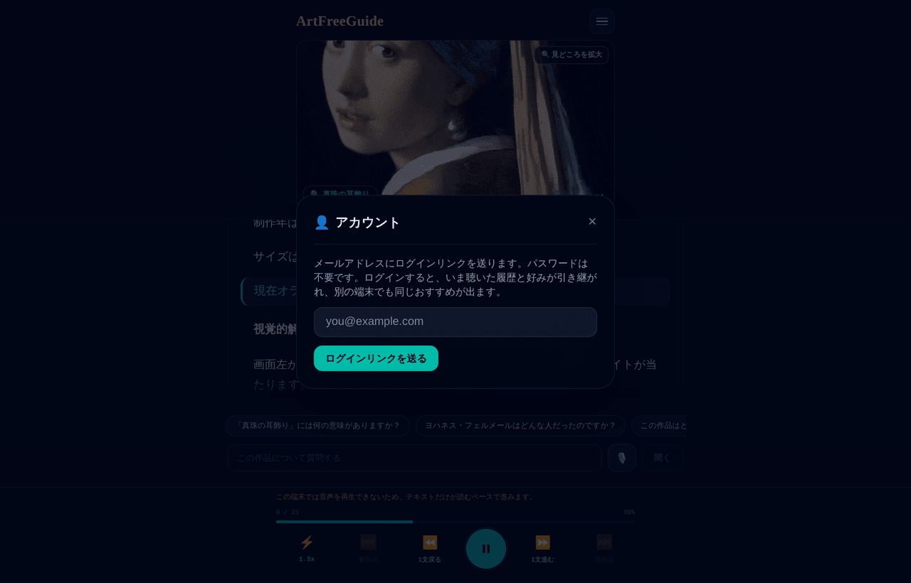

<p align="center">
  
</p>

<h1 align="center">ArtFreeGuide</h1>

<p align="center">
  <b>聴くほど賢くなる、美術館の AI 音声ガイド。</b><br>
  あなたの質問と指摘で、解説そのものが育っていきます
</p>

<p align="center">
  <a href="https://art-free-guide.taira-sakakibara.workers.dev">
    
  </a>
  <a href="#ハッカソンのポイント-ベクトル検索">
    
  </a>
  <a href="https://github.com/t-sakaki/ArtFreeGuide">
    
  </a>
</p>

普通の音声ガイドは、誰が何回聴こうと同じテープを繰り返します。ArtFreeGuide は違います — **聴いた人の質問と指摘が、その場で解説に入り、次の来訪者が聴くガイドになります**。聴けば聴くほど、作品の解説も、あなたへの推薦も賢くなるガイドです。

作品名を入れるだけで、AI が学芸員のように解説を書き起こし、1 文ずつ読み上げます。絵の「見どころ」は画像上でポイントされ、気になったことはその場で質問でき、聴いた作品からベクトル検索で「次の 1 枚」を提案します。専用のガイド機を借りず、手元のスマートフォンだけで完結します。

- サービス URL: https://art-free-guide.taira-sakakibara.workers.dev
- リポジトリ: https://github.com/t-sakaki/ArtFreeGuide

<p align="center">
  
</p>

## 聴くほど賢くなる、とは

「賢くなる」はキャッチフレーズではなく、実際に保存されて次の人に届く仕組みです。ガイドは四つの経路で育ちます。

| 聴く人の行動 | ガイドに起きること | 残る場所 |
| --- | --- | --- |
| 質問する | AI の回答がその場で読み上げられ、解説本文に追記される | D1 の解説アーカイブ（`/api/guide/augment`） |
| 裏話を押す | さらに深いエピソードが生成され、次の来訪者にも届く | 同上 |
| 気になる点を送る | AI キュレーターが指摘を読み、**何をどう直したかをその場で返答**して修正案を作る（承認後に全員へ反映） | `guide_corrections` の承認キュー |
| 聴き進める | 好みベクトルが更新され、「あなたへのおすすめ」があなたに寄っていく | `user_profiles.preference_embedding_nv`（pgvector） |

とくに「気になる点」は、送って終わりのご意見箱ではありません。長すぎる / 難しい / 事実が違う / 退屈 / 読み上げが不自然 を 1 タップで選ぶと、AI がその理由に沿って解説を作り直し、何を直したかを一文で答えます。

カタログにない作品も、誰かが一度聴けば埋め込みが作られ、以後は推薦の候補になります。利用されるほど、ガイドの収蔵自体が広がります。

なお、利用は無料です（インストールもログインも不要）。ただし、このプロダクトの価値は価格ではなく、上の四つのループにあります。

## すぐ聴けるツアー

インストールもログインも不要です。リンクを開くと、その場でツアーが始まります（1 ツアー 4〜5 作品、所要 10〜15 分）。

### 🌅 [光をつかまえた画家たち](https://art-free-guide.taira-sakakibara.workers.dev/impressionism) — 印象派が「見えたまま」を描くまで

[印象・日の出](https://art-free-guide.taira-sakakibara.workers.dev/impression-sunrise) → [睡蓮](https://art-free-guide.taira-sakakibara.workers.dev/water-lilies) → [ムーラン・ド・ラ・ギャレットの舞踏会](https://art-free-guide.taira-sakakibara.workers.dev/bal-du-moulin-de-la-galette) → [踊りの稽古場にて](https://art-free-guide.taira-sakakibara.workers.dev/the-dance-class) → [星月夜](https://art-free-guide.taira-sakakibara.workers.dev/the-starry-night)

### 🌊 [北斎と日本の美](https://art-free-guide.taira-sakakibara.workers.dev/hokusai) — 波、風神雷神、そして琳派へ

[神奈川沖浪裏](https://art-free-guide.taira-sakakibara.workers.dev/the-great-wave-off-kanagawa) → [凱風快晴](https://art-free-guide.taira-sakakibara.workers.dev/fine-wind-clear-morning) → [東海道五十三次](https://art-free-guide.taira-sakakibara.workers.dev/the-fifty-three-stations-of-the-tokaido) → [風神雷神図屏風](https://art-free-guide.taira-sakakibara.workers.dev/wind-god-and-thunder-god-screens) → [色絵藤花文茶壺](https://art-free-guide.taira-sakakibara.workers.dev/tea-jar-with-wisteria-design)

### 😱 [不安のかたち](https://art-free-guide.taira-sakakibara.workers.dev/anxiety) — 近代が抱えた叫びと悪夢

[叫び](https://art-free-guide.taira-sakakibara.workers.dev/the-scream) → [我が子を食らうサトゥルヌス](https://art-free-guide.taira-sakakibara.workers.dev/saturn-devouring-his-son) → [記憶の固執](https://art-free-guide.taira-sakakibara.workers.dev/the-persistence-of-memory) → [ゲルニカ](https://art-free-guide.taira-sakakibara.workers.dev/guernica)

### 🏛️ [ルネサンスの巨匠たち](https://art-free-guide.taira-sakakibara.workers.dev/renaissance) — 人間を主役にした時代

[ヴィーナスの誕生](https://art-free-guide.taira-sakakibara.workers.dev/the-birth-of-venus) → [モナ・リザ](https://art-free-guide.taira-sakakibara.workers.dev/mona-lisa) → [最後の晩餐](https://art-free-guide.taira-sakakibara.workers.dev/the-last-supper) → [ダビデ像](https://art-free-guide.taira-sakakibara.workers.dev/david) → [最後の審判](https://art-free-guide.taira-sakakibara.workers.dev/the-last-judgment)

### 🌻 [ゴッホ、10 年の物語](https://art-free-guide.taira-sakakibara.workers.dev/vangogh) — 一人の画家の人生をたどる

[ジャガイモを食べる人々](https://art-free-guide.taira-sakakibara.workers.dev/the-potato-eaters) → [ひまわり](https://art-free-guide.taira-sakakibara.workers.dev/sunflowers) → [夜のカフェテラス](https://art-free-guide.taira-sakakibara.workers.dev/cafe-terrace-at-night) → [星月夜](https://art-free-guide.taira-sakakibara.workers.dev/the-starry-night) → [カラスのいる麦畑](https://art-free-guide.taira-sakakibara.workers.dev/wheatfield-with-crows)

### 🌓 [光と影のドラマ](https://art-free-guide.taira-sakakibara.workers.dev/light-and-shadow) — バロックから近代へ、光の描き方をたどる

[夜警](https://art-free-guide.taira-sakakibara.workers.dev/the-night-watch) → [真珠の耳飾りの少女](https://art-free-guide.taira-sakakibara.workers.dev/girl-with-a-pearl-earring) → [我が子を食らうサトゥルヌス](https://art-free-guide.taira-sakakibara.workers.dev/saturn-devouring-his-son) → [星月夜](https://art-free-guide.taira-sakakibara.workers.dev/the-starry-night) → [記憶の固執](https://art-free-guide.taira-sakakibara.workers.dev/the-persistence-of-memory)

### 🎨 [情熱の色彩](https://art-free-guide.taira-sakakibara.workers.dev/passion-colors) — 黄金と赤、そして静けさへ

[ひまわり](https://art-free-guide.taira-sakakibara.workers.dev/sunflowers) → [接吻](https://art-free-guide.taira-sakakibara.workers.dev/the-kiss) → [ゲルニカ](https://art-free-guide.taira-sakakibara.workers.dev/guernica) → [叫び](https://art-free-guide.taira-sakakibara.workers.dev/the-scream) → [睡蓮](https://art-free-guide.taira-sakakibara.workers.dev/water-lilies)

### 🏛️ [ルネサンスの理想美](https://art-free-guide.taira-sakakibara.workers.dev/renaissance-ideal) — 調和と均衡、そしてその崩壊

[アテナイの学堂](https://art-free-guide.taira-sakakibara.workers.dev/the-school-of-athens) → [ヴィーナスの誕生](https://art-free-guide.taira-sakakibara.workers.dev/the-birth-of-venus) → [ダビデ像](https://art-free-guide.taira-sakakibara.workers.dev/david) → [モナ・リザ](https://art-free-guide.taira-sakakibara.workers.dev/mona-lisa) → [アビニヨンの娘たち](https://art-free-guide.taira-sakakibara.workers.dev/les-demoiselles-davignon)

### 1 枚だけ聴くなら

[睡蓮](https://art-free-guide.taira-sakakibara.workers.dev/water-lilies)（見どころポインターが分かりやすい） / [真珠の耳飾りの少女](https://art-free-guide.taira-sakakibara.workers.dev/girl-with-a-pearl-earring) / [牛乳を注ぐ女](https://art-free-guide.taira-sakakibara.workers.dev/the-milkmaid) / [レースを編む女](https://art-free-guide.taira-sakakibara.workers.dev/the-lacemaker) / [星月夜](https://art-free-guide.taira-sakakibara.workers.dev/the-starry-night) / [モナ・リザ](https://art-free-guide.taira-sakakibara.workers.dev/mona-lisa)

英語で聴く場合は `?lang=en` を付けてください（例: [Girl with a Pearl Earring in English](https://art-free-guide.taira-sakakibara.workers.dev/girl-with-a-pearl-earring?lang=en)）。`fr` / `es` / `zh` も同様ですが、未生成の言語は初回のみ生成に 1 分ほどかかります。

## 画面イメージ

### 解説を 1 文ずつ聴く

作品名を入れると解説が生成され、読み上げ中の文がハイライトされます。速度、文の戻し／送り、質問、次の作品への導線は 1 画面に収めています。


### 見どころを絵の上でポイントする

普段はほぼ透明な点で、いま語っている 1 点だけがゆっくり明滅します。拡大表示では見どころごとに絵をズームし、その部分だけを解説します。





### ベクトル検索によるおすすめ

「この作品に近い」は pgvector の近傍検索の結果で、数値は類似度です。聴くほど好みベクトルが更新され、並びが変わります。



### テーマ別ツアーと作品検索



### 多言語（日本語 / 英語 / フランス語 / スペイン語 / 中国語）

UI だけでなく、解説の生成と読み上げも切り替わります。



### 匿名のまま使えて、ログインすると引き継げる

Supabase Auth のマジックリンクでログインすると、匿名で溜めた履歴と好みが同じアカウントに移ります。



## できること

| 機能 | 概要 |
| --- | --- |
| AI 音声ガイド | 作品名（＋作家名）から解説を生成し、Web Speech API で 1 文ずつ読み上げ。速度調整、文単位の巻き戻し／送りに対応 |
| 見どころポインター | 作品画像の上に見どころを配置。普段はほぼ透明で、いま語っている 1 点だけがゆっくり明滅し、絵の鑑賞を邪魔しない |
| 質問 | サジェスト質問＋自由入力（音声入力も可）。回答はガイド本文に追記され、保存されて次の来訪者にも届く |
| 裏話・エピソード | ボタン 1 つでさらに深い話を追加生成し、それも解説に蓄積される |
| ベクトル検索レコメンド | 作品埋め込みと「好みベクトル」による近傍検索で次の作品を提案（後述） |
| テーマ別ツアー | 「光と影のドラマ」「情熱の色彩」「ルネサンスの理想美」など、カタログから組んだツアー |
| 視聴履歴 | 聴いた作品を保存し、続きから再生。好みベクトルの材料にもなる |
| 共有リンク | 作品ごとの OGP（タイトル・説明・サムネイル）付きで、SNS やチャットにカード表示 |
| 多言語 | 日本語 / 英語 / フランス語 / スペイン語 / 中国語の UI・解説・読み上げ |
| 読み間違いの報告 → 承認 → 反映 | 読み上げの誤りを利用者が報告し、管理者が承認すると以後の TTS に反映される |
| AI キュレーターへの指摘 | 理由を 1 タップで選ぶと、AI がその場で何を直したかを返答し、その理由に沿って解説を作り直す |
| 解説の修正提案 → 承認 → 反映 | 内容の誤りを報告すると LLM が修正案を作り、管理者が差分を見て承認すると保存済み解説が置き換わる |
| ログイン（任意） | 匿名のまま使えて、Supabase Auth のマジックリンクでログインすると匿名の履歴・好みをアカウントに引き継ぐ |

## 検索エンジンへの登録（SEO）

作品・ツアーはすべて英語スラグのパーマリンク（`/the-milkmaid`、`/impressionism` など）を持ち、検索エンジンから直接たどれます。

- サイトマップ: <https://art-free-guide.taira-sakakibara.workers.dev/sitemap.xml>（235 URL、`src/app/sitemap.ts` が作品・ツアー・言語ごとに自動生成）
- robots.txt: <https://art-free-guide.taira-sakakibara.workers.dev/robots.txt>（クロール許可＋サイトマップ行）
- Google Search Console に所有権確認済みで、上記サイトマップを送信・登録済み
- 各ページに canonical URL・メタディスクリプション・OGP を出力（`src/lib/guideMetadata.ts`）

## ハッカソンのポイント: ベクトル検索

推薦の中核は Supabase（Postgres + pgvector）上のベクトル検索です。

- 作品は NVIDIA NIM の埋め込みモデル `nvidia/llama-nemotron-embed-1b-v2`（1024 次元）でベクトル化し、`public.artworks.embedding_nv` に保存
- 索引は ivfflat（コサイン類似度）。近傍探索は RPC `match_artworks_nv(query_embedding, match_threshold, match_count)`
- 利用者ごとに、聴いた作品のベクトルから **好みベクトル**（`user_profiles.preference_embedding_nv`）を作り、そのベクトルで「あなたへのおすすめ」を検索
- カタログに無い作品もガイド生成時にその場で埋め込みを作るので、検索対象がユーザーの利用とともに増える
- 埋め込みモデルを載せ替えると類似度の絶対値が変わるため、しきい値は `EMBEDDING_MATCH_THRESHOLD`（NVIDIA では 0.25）で外出しし、実データで再調整
- 旧 Workers AI（bge-m3）の列・関数も残しており、`EMBEDDING_PROVIDER` の 1 語でロールバックできる

## Supabase の活用

- **pgvector**: 作品埋め込みと好みベクトル、近傍検索の RPC（`match_artworks_nv` / `match_artworks`）
- **カタログと履歴**: `artworks` / `viewing_history` / `user_profiles`（匿名プロフィールとして作成され、ログイン時に `auth_user_id` で Auth ユーザーへ紐付け）
- **Auth（マジックリンク）**: 一般利用者のログインと、管理者判定（`ADMIN_EMAILS` に載るアドレスのみ承認 UI を開ける）
- **モデレーション用テーブル**: 読みの修正案（`pronunciation_corrections`）と解説の修正案（`guide_corrections`）を pending → approved で管理
- **RLS**: 匿名クライアントは anon キーのみを使い、サービスロールキーはサーバー（Worker）専用

スキーマは `supabase/migrations/` にあり、Supabase の SQL Editor でそのまま実行できます。

## Devin の活用

このプロジェクトは、開発者と Devin の共同作業で作られています。日々の実装は「作りたい体験を日本語で伝える → Devin が調査・実装・検証して PR を出す → レビューしてマージ」というループで進めました。

- 機能追加は基本的に PR 単位（例: 埋め込みの NVIDIA NIM 移行 #51、読み辞書と承認フロー #54、ログインと匿名履歴の引き継ぎ #55、フィードバックからの解説修正 #57、共有リンクの OGP #58、見どころマーカーの調整 #59/#60、読み上げのペース修正 #63、本番の Supabase 設定取得 #64）
- 実機での確認まで含めて依頼できるので、「ポインターが強すぎる」「一瞬で読み終わってしまう」といった体験の違和感を、そのままの言葉で投げて直せる
- クォータ枯渇（Workers AI の無料枠）のような外部要因も、代替プロバイダへの移行と旧実装のロールバック経路の確保まで含めて任せられる

## アーキテクチャ

```
ブラウザ (Next.js 16 / React 19 / Tailwind)
  ├── Web Speech API ... 読み上げ・音声入力（読み替え辞書を適用）
  ├── Web Audio API  ... 作品の雰囲気に合わせた環境音の生成
  └── fetch
        ↓
Cloudflare Workers（OpenNext）
  ├── /api/chat            解説生成（LLM）＋ D1 にキャッシュ
  ├── /api/ask             質問への回答
  ├── /api/suggest         作品名サジェスト
  ├── /api/recommendations ベクトル近傍検索でおすすめ
  ├── /api/history         視聴履歴と好みベクトルの更新
  ├── /api/readings        読みの報告 / 承認済み辞書の配信
  ├── /api/feedback        good / bad / bug（bad・bug は修正案生成へ）
  ├── /api/admin/*         承認キュー（Supabase Auth + ADMIN_EMAILS）
  └── /api/og-image        共有カードの画像
        ↓
  Cloudflare D1        生成済み解説のアーカイブ
  Supabase (Postgres)  カタログ / 履歴 / プロフィール / 承認キュー / pgvector
  NVIDIA NIM           解説生成と埋め込み
  Wikimedia Commons    作品画像
```

技術スタック: Next.js 16 (App Router) / React 19 / TypeScript / Tailwind CSS / Cloudflare Workers (OpenNext) / Cloudflare D1 / Supabase (Postgres + pgvector, Auth) / NVIDIA NIM / Web Speech API / Web Audio API / Wikimedia Commons API

## ローカルでの動かし方

```bash
npm install
cp .env.example .env.local   # Supabase の URL / キー、NVIDIA_API_KEY などを設定
npm run dev                  # http://localhost:3000
```

Supabase を使う場合は `supabase/migrations/` の SQL を番号順に SQL Editor で実行してください。D1 のマイグレーションは `d1/migrations/` にあります。

主な環境変数（詳細は `.env.example`）:

| 変数 | 用途 |
| --- | --- |
| `NEXT_PUBLIC_SUPABASE_URL` / `NEXT_PUBLIC_SUPABASE_ANON_KEY` | ブラウザ用の公開設定（ログイン） |
| `SUPABASE_SERVICE_ROLE_KEY` | サーバー専用。RLS を迂回するのでブラウザには渡さない |
| `LLM_PROVIDER` / `NVIDIA_API_KEY` | 解説生成のプロバイダと鍵（`nvidia` / `workers-ai` / `gemini`） |
| `EMBEDDING_PROVIDER` / `EMBEDDING_MATCH_THRESHOLD` | 埋め込み空間としきい値 |
| `GUIDE_STORE` | 生成済み解説の保存先（`d1` / `supabase` / `memory`） |
| `ADMIN_EMAILS` | 承認 UI を開けるメールアドレス（カンマ区切り） |

デプロイ:

```bash
npm run deploy               # OpenNext でビルドし Cloudflare へ
npx wrangler secret put NVIDIA_API_KEY
```

埋め込みの補完（新規作品の追加後など）:

```bash
EMBEDDING_PROVIDER=nvidia NVIDIA_API_KEY=... node scripts/backfill_embeddings.mjs
```

## リポジトリ構成

```
src/app/          画面（HomeClient.tsx）と API ルート
src/components/   作品ステージ、見どころ、おすすめ棚、承認 UI など
src/lib/          LLM / 埋め込み / 推薦 / 読み辞書 / i18n / 共有メタなど
supabase/         Supabase のマイグレーション
d1/               D1 のマイグレーション
scripts/          埋め込みバックフィル
docs/             設計メモ、README 用スクリーンショット、ヒーロー/OGP 画像の生成元（docs/brand）
```

## 今後

- 写真からの作品認識（OCR / 画像検索）でタイトル入力を不要に
- 承認済みの修正を学習データとして蓄積し、生成そのものの品質を上げる
- 館内のフロア動線に沿ったツアーの自動生成
