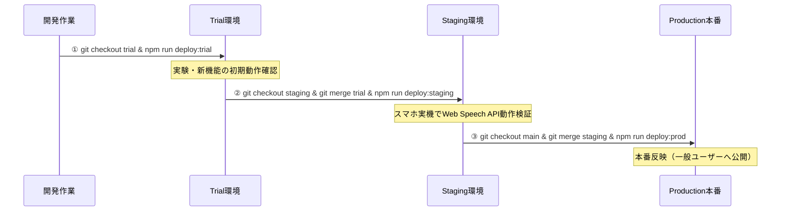

# 🌐 3環境運用ガイド (Environment Setup Guide)

本ドキュメントは「ArtFreeGuide」における **Production（本番） / Staging（検証） / Trial（お試し・実験）** の3環境構成と運用フローをまとめたものです。

---

## 1. 各環境の概要と役割

| 環境名 | ブランチ | Worker / アプリ名 | 目的・運用ルール |
| :--- | :--- | :--- | :--- |
| **Trial (お試し・実験)** | `trial` | `art-free-guide-trial` | ・アイデア試作、UI変更、新機能の社内・関係者テスト<br>・失敗しても本番/検証に影響を与えない実験場 |
| **Staging (最終検証)** | `staging` | `art-free-guide-staging` | ・本番リリース直前の最終テスト環境<br>・スマホ実機（iOS Safari, Android Chrome）で音声再生等の実動作を確認する |
| **Production (本番)** | `main` | `art-free-guide` | ・エンドユーザーが利用する本番環境<br>・Stagingで動作確認が取れたコードのみを反映する |

---

## 2. デプロイコマンド一覧

`package.json` に設定された以下のスクリプトを利用してデプロイを行います。

```bash
# 1. Trial (お試し環境) へのデプロイ
npm run deploy:trial

# 2. Staging (検証環境) へのデプロイ
npm run deploy:staging

# 3. Production (本番環境) へのデプロイ
npm run deploy:prod
```

---

## 3. 推奨開発・反映フロー



1. **開発・試作**: `trial` ブランチで新機能開発し、`npm run deploy:trial` で実験URLにてテスト。
2. **検証**: 内容が固まったら `staging` ブランチへマージし、`npm run deploy:staging` でスマホ実機動作チェック。
3. **本番リリース**: 音声再生等の問題がないことを確認後、`main` ブランチへマージして `npm run deploy:prod` を実行。
